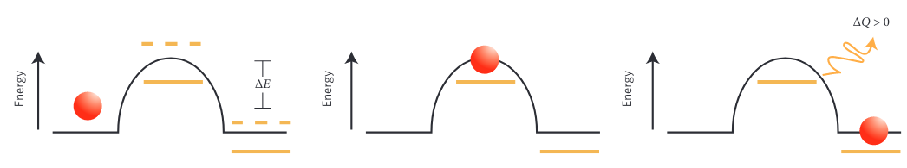

+++
title = "Notes on Every Life is on Fire"
date = 2023-12-09
category = "notebook"
author = "Tim"
tags = ["statistical mechanics", "dissipative adaptation", "thermodynamics", "life"]
description = "Concepts and notes from Every Life Is on Fire: How Thermodynamics Explains the Origins of Living Things and dissipative adaptation"
katex = true
showTableOfContents = false
+++

# Concepts
- **Macroscopic coarse-graining** - many microscopic ways of arranging matter that have the same macroscopic (coarse) features, indistinguishable when considering the whole
- **Entropy**- $S$, number of microscopic ways a given coarse grained outcome can be achieved.
- **Boltzmann Distribution** - The probability that a system is in a given microstate $p_i$ is proportional to its temperature $T$ and energy $E$.
	
	$$p_i \propto \exp(-\frac{E}{k_BT})$$
	
	where $k_B$ is the Boltzmann constant. High energy states are exponentially less likely to be visited than lower, but the exponential gets shallower as temperature, $T$, increases.
- **Free Energy** - $F$, change in free energy is the maximum amount of work that the system can perform at constant temperature. Corresponds to the Boltzmann probability of a coarse-grained state. Higher probability corresponds to lower free energy. Lower free energy is achieved either through lower energy and/or higher entropy.
	$$F = E - T S$$
- **Crooks Equation**  (Crooks fluctuation theorem) - The probability of a forward-in-time trajectory, $P[x(t)]$ to the reverse trajectory $\tilde{P}[\tilde{x}(t)]$ is exponentially more likely given that the forward-in-time trajectory produces entropy. 
	
	$$\frac{P[x(t)]}{\tilde{P}[\tilde{x}(t)]}=e^{\sigma[x(t)]}$$
	
	Once heat diffuses, it is very unlikely to randomly return. Systems that are directional release heat, but if their energy is not decreasing, and total energy is conserved, another external source must be injecting energy.
- **Non-equilibrium Steady State** - Stable system not at thermal equilibrium. They do not appear the same under time-reversal and contrast with systems at thermal equilibrium. Must have a continuous external drive of energy to remain in this state.
- **Time reversal symmetry breaking** - Replication and other behaviors need to achieve a state which is not at lowest energy but is also stable. According to Crooks equation, staying in a state which is not at thermal equilibrium through random fluctuations is unlikely. Being in this state breaks the symmetry of forward/backward trajectories being equally likely.
	External energy or force inputs are necessary for symmetry breaking to occur and keep the system in a state  it would not inhabit through random fluctuations
- Life needs to be able to resist environmental thermal fluctuations leading to increased entropy without being frozen in a rigid configuration. A crystal-like low energy state has no flexibility to reorganize itself in response to the environment. In order to be both flexible and resistant, a sustained energy input is required.
- Subjecting inanimate matter or simulations to an external drive can result in the spontaneous emergence of structure.
- **Dissipative Adaptation**
	- The self-organization of a system based on interaction with its environment. This process is affected by the structure of the system, but the energy input can also create a re-arrangement of the system creating new relationships between the system and the environment. The system may adapt into a configuration which is good at absorbing energy or dissipating excess energy.
	
    
    *Energy barrier transition, (reproduced from [2])*
    

    - Given an external drive, certain configurations of the system may be better than others at absorbing work. If the system is configured in such a way that the energy from the external drive enables the transition of energy barriers followed by the dissipation of energy, then the system will not be able to transition back. Over time the system will adopt states that allowed this process to occur appearing to have self-organized based on its environment. If the environment changes, the system can reconfigure yet again.
	-
- ## References
	- [1] England, Jeremy. *Every Life Is on Fire: How Thermodynamics Explains the Origins of Living Things*. 2020.
	- [2] England, Jeremy L. “Dissipative Adaptation in Driven Self-Assembly.” *Nature Nanotechnology*, November 1, 2015. [https://doi.org/10.1038/nnano.2015.250](https://doi.org/10.1038/nnano.2015.250).
	-