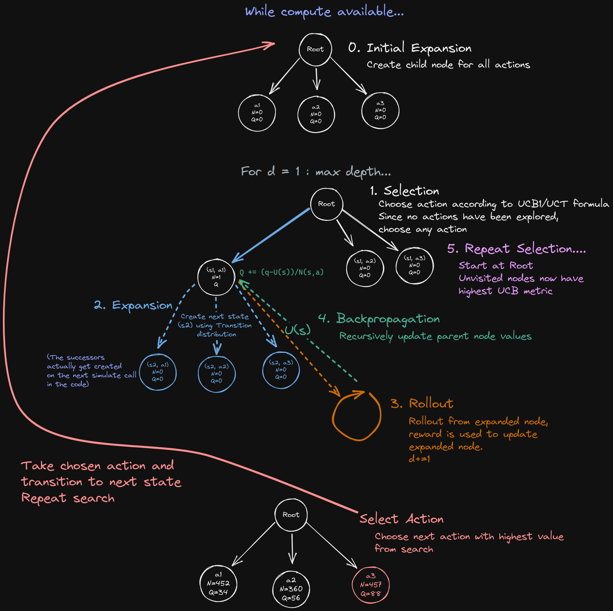

+++
title = "Monte Carlo Tree Search"
date = 2023-02-14
category = "notebook"
author = "Tim"
tags = ["decision making", "Julia", "uncertainty", "monte carlo tree search"]
description = "Explanation of Monte Carlo Tree Search Algorithm for solving POMDPs"
katex = true
+++


Monte Carlo Tree Search (MCTS) is an algorithm used in decision-making and search problems. The algorithm builds a search tree of possible moves and outcomes, exploring the tree by simulating a number of games to determine the best moves. MCTS balances exploration of unexplored nodes and exploitation of nodes that have shown promise in the past. The algorithm selects the best move to make from the current game state based on the statistics collected during the simulation phase.


# Algorithm





- Initialize
	- POMDP problem
	- Root node
	- Hyperparameters
		- $d$ = search depth
		- $m$ = search simulations before choosing best action
		- $c$ = exploration constant
		- $U$ = value function estimate method, rollout simulator


**For $m$ simulations, do:**


1. **Selection**:
	- If first simulation: 
		- **Expand** root node creating child nodes for all possible actions (or modification).
		- Return value estimate from root node using rollout
	- If not first simulation:
		- Select best action according to UCB metric
			- $Q(s, a)+c \sqrt{\frac{\log N(s)}{N(s, a)}}$
2. **Expansion**:
	- If node has no children and is not terminal expand it.
		- Create next state, $s'$ using transition distribution and chosen action, creating new unexplored nodes for each possible action from $s'$.
		- The transition distribution won't necessarily yield the same $s'$ next time this action is taken from $s$.
	- If node has children and not at max depth, return to **Selection**
3. **Rollout**:
	- When max depth is reached, get value estimate using rollout and policy. This is the leaf node.
4. **Backprop**:
	- Recursively propagate value estimate at leaf node backwards through tree, updating value estimate $Q$ at each parent using current reward + discounted future reward.

# Code
Based on [1] with additional explanation.
```julia
mutable struct  MCTS
    P # problem MDP or POMDP
    N # visit counts, dictionary over (s, a) pairs
    Q # value estimates, dictionary over (s, a) pairs
    d # depth, search horizon
    m # number of simulations before choosing an action
    c # exploration constant
    U # value function estimate, rollout simulator or other method
end

function (π::MCTS)(s)
    for k in 1:π.m
        simulate!(π, s)
    end
    # return action with highest value estimate from 
    # the set of actions available in state s
    return argmax(a->π.Q[s,a], actions(π.P, s))
end
bonus(Na, Ns) = Na ==
function simulate!(π::MCTS, s, d=π.d)
    # if at max depth, return value estimate for state s
    if d <= 0
        return π.U(s)
    end
    # get problem, visit counts, value estimates, exploration constant
    P, N, Q, c = π.P, π.N, π.Q, π.c
    # get actions, transition function, discount factor
    A, TR, γ = actions(P, s), transition(P, s), discount(P)
    # if node has not been explored, expand it, creating a new node for each action
    # (i.e. add it to the tree)
    # initializing visit counts and value estimates to 0 for all actions
    # (another method could be used to set the initial value estimate)
    if !haskey(N, (s, first(A)))
        for a in A
            N[(s, a)] = 0
            Q[(s, a)] = 0.0
        end
        # return value estimate for this state through rollout
        return π.U(s)
    end
    # if node has been expanded, select action according to UCB1 formula
    a = explore(π, s)
    # transition to next state and get reward
    sp, r = TR(a)
    # set value to reward plus discounted value estimate for next state
    q = r + γ * simulate!(π, sp, d-1)
    # update visit count and value estimate for this state-action pair
    N[(s, a)] += 1
    Q[(s, a)] += (q - Q[(s, a)]) / N[(s, a)]
    return q
end

# unexplored actions have infinite bonus
bonus(Na, Ns) = Na == 0 ? Inf : sqrt(log(Ns) / Na)

function explore(π::MCTS, s)
    A, N, Q, c = actions(π.P, s), π.N, π.Q, π.c
    # sum over all actions for the number of visits to the node
    Ns = sum(N[(s, a)] for a in A)
    # return action with highest value estimate plus bonus * exploration constant
    return argmax(a->Q[(s, a)] + c * bonus(N[(s, a)], Ns), A)
end

POMDPs.transition(P, s) = (a)-> @gen(:sp, :r)(P, s, a)

function U(P, policy, s)
    # rollout simulator
    # simulate policy from current node returning reward
    sim = RolloutSimulator(max_steps=10)
    r = simulate(sim, P, policy, s)
    return r
end
```

# Modifications
- (Double) Progressive Widening
	- Limit the number of actions considered from state $s$
	- Limit the number of states resulting from action $a$
- Other rollout methods


## References

[1] M. J. Kochenderfer, T. A. Wheeler, and K. H. Wray, Algorithms for decision making. Cambridge, Massachusetts: The MIT Press, 2022.

